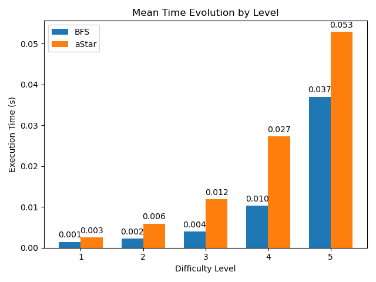

# sudoku-python

This working is part of Unisinos 's Computer Science postgraduate program. Here you can find two sudoku solvers approaches, firstly a implementation of [Breadth-first Search](https://en.wikipedia.org/wiki/Breadth-first_search). Second is used a implementation based on [A* Search Algorithm](https://en.wikipedia.org/wiki/A*_search_algorithm).
 A simple python console application that reads an input sudoku from [input.txt](input.txt) and solves it using above algorithms.

 ## Table of contents

- [User Instructions](#User-Instructions)
- [Basic Utilization](#Basic-Utilization)
- [Advanced Utilization](#Advanced-Utilization)
- [Performance Analysis and Comparison](#Performance-Analysis-and-Comparison)
- [Load for Test Solving Algorithms](#Load-for-Test-Solving-Algorithms)
- [Performance Metrics](#Performance-Metrics)
- [Analysis of algorithms](#Analysis-of-algorithms)

- [Prerequisites](#Prerequisites)
- [Authors](#authors)

 ## User Instructions
 ### Basic Utilization

 First insert the board to solve in the file [input.txt](input.txt) in format like this:

5 3 _ | _ 7 _ | _ _ _ 
6 _ _ | 1 9 5 | _ _ _ 
_ 9 8 | _ _ _ | _ 6 _ 
------+-------+------ 
8 _ _ | _ 6 _ | _ _ 3 
4 _ _ | 8 _ 3 | _ _ 1 
7 _ _ | _ 2 _ | _ _ 6 
------+-------+------ 
_ 6 _ | _ _ _ | 2 8 _ 
_ _ _ | 4 1 9 | _ _ 5 
_ _ _ | _ 8 _ | _ 7 9 

Before insert confirm if this is a valid sudoku board.

Second step is to run the [main.py](main.py) and select the algorithm to solve the board. Chose one of four options, 1 resolve using BFS, 2 resolve using aStar, 3 resolve using both and 4 exit of program.

 ### Advanced Utilization

To regenerate tests and new analysis run the [tests](tests.py). And to regenerate plots just run [data_analysis](data_analysis.py)

 ##  Performance Analysis and Comparison
In this section will evaluate the performance of our proposals algorithms to solve sudoku codified here. Basically will discuss about performance the two algorithms proposals implemented in this code, the algorithms BFS and aStar.

 ### Load for Test Solving Algorithms

For testing performance of both algorithms we use [py-sudoku project](https://pypi.org/project/py-sudoku/). We imported this project to our code, in [sudoku.py](generator/sudoku.py,) to edit print method with objective to facilitate the conversion of sudoku board to array. With this package we implement our code to generate five files each containing 100 randomly generated frames, first one file with 10% of blanc spaces, next one with 20% up until 50 % the blanc spaces (more complexity).
Observation: with complexity bigger than 50% of blanc spaces  our implementation of aStar algorithm entry in loop. 
We not make tests with more complexity because the execution time tends to increase exponentially. And the purpose of this analysis is not to prove that our implementations are better, but to show our ability to implement them and analyze performance.

For generate the tests boards and calculate yours outputs run [tests.py](tests.py). When run generated boards will be allocated in path [inputs](tests/inputs/). The results of the tests will be allocated in
path [results](tests/results/). The results are composed by number of steps and time for resolution for each algorithm.

 ### Performance Metrics

Two metrics were chosen to analyze the performance of both algorithms. The first is the number of steps or in the case of our implementation, the number of nodes in the tree is expanded. Second is the execution time, this will vary depending on the processing capacity of the machine on which the code will be executed, but the number of steps will be the same regardless of the processing power. This is because the logic is the same regardless of the machine that will run the code, simply the fastest machine will perform the necessary steps more quickly. Logically, for this analysis, all codes were executed on the same machine under the same conditions for a fair comparison.

 ### Analysis of algorithms

To execute analysis of both algorithms run [data_analysis.py](data_analysis.py), he's calculate the median steps and time to solve boards for each difficult level (10% until 50% of blanc spaces in boards), the output of these calculations are in [tests](tests/) folder, one to aStar e one to BFS.
First row is to difficult level min, in other words 10 % of blanc spaces, second row to 20% and so on, until 50 %. First data in each row are median execution time for this difficulty level, second median steps, third  max number of steps, fourth min number of steps, fifth max execution time and sixth min execution time. After all calculations are plotted several pictures to provide a best analysis of the algorithms performance.

In the graphics bellow we show median steps and time respectively necessary for both algorithms solve 100 boards generated aleatory for each complexity level, that is 10 % of blanc spaces in 100 first board for level one, 20%  in 100 secondly boards for level two and so on, until 50 % for level five. More graphics can be seen in the path [plots](plots/).

 #### Analysis of steps number

In the graphics bellow we can see that up to the level of complexity three, that is, with 30% of blank spaces, the implementation of BFS tends to require a smaller number of steps. After level four, aStar starts to see a small improvement, of 6.06%, over the number of steps of the BFS. Already at kevel five, aStar shows a significant improvement in the number of steps over BFS, this improvement was 67%.

 #### Analysis of execution time

 In the graphics bellow we can see that the runtime is greater for aStar implementation in all levels of complexity. This is because the computation of step numbers ignores the computational cost necessary for calculating heuristics in aStar.

## Prerequisites
  * Python 3
  * Package numpy

## Authors
Gustavo Zanatta Bruno @zanattabruno
Guilherme Falcão Silva Campos @guilhermefscampos